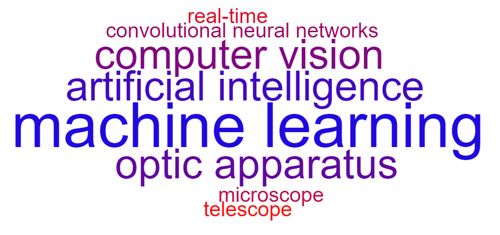

# SmartScope


## Instalare SmartScope Micro
```
git clone https://github.com/Bisoros/SmartScopeMicro
pip install -r requirements.txt
python gui.py
```

## Instalare SmartScope Macro
- instalează darknet (http://pjreddie.com/darknet/yolo)
- rulează următoarele comenzi în terminal:
```
git clone https://github.com/Bisoros/SmartScopeMicro
pip install -r requirements.txt
cd macro
```
- editează variabila `path = '/path/to/darknet/'`din wrapper.py
- pornește scriptul:
```
python wrapper.py
```
## Keybinds
#### SmartScope Micro:
- Space - Scan
- Esc - Exit
- S - Save last scan
- C - Clear screen
- Z - Zoom
- \> or < - Change weights
- ? - Help menu

#### SmartScope Macro:
- Esc - Exit
- T - Toggle trajectory highlight
- R - Toggle recording
- S - Screenshot
- C - Clear screen
- ? - Help menu

## Descriere
SmartScope este un proiect care abordează rețele neuronale convoluționale în scopul îmbunătățirii experienței de utilizare a unui aparat optic convențional. Acesta constă din două subproiecte: SmartScope Micro și SmartScope Macro. \
SmartScope Micro este un microscop bazat pe inteligență artificială ce clasifică natura materialului cu care vine în contact. SmarScope Macro este un telescop care utilizează conceptul de machine learning  pentru a detecta și evidenția traiectoria obiectelor celeste în timp real.

## Tehnologii
#### SmartScope Micro:
- limbaj de programare: Python 3
- module folosite:
  - TensorFlow - rețele neuronale
  - OpenCV - afișarea datelor procesate
  - imutils - manipularea imaginilor
  - Selenium - obținerea imaginilor pentru antrenare
  - Tkinter - GUI
  - dependențele aferente modulelor
- microscop USB 1000x

#### SmartScope Macro:
- limbaj de programare: Python 2
- module folosite:
  - OpenCV - afișarea datelor procesate
  - Tkinter - GUI
  - dependențele aferente modulelor
- neural network framework: Darknet
- bibliotecile CUDA și cuDNN

## Cerințe sistem
- Sistem de operare: Linux, Windows sau Mac OS X
- Procesesor: >= 1.2 GHz
- RAM: >= 1 GB

SmartScope Macro necesită și un GPU CUDA.

## Cod preluat din surse deschise
- funcția zoom din scripts/smartscope.py - http://github.com/CJoseFlores/python-OpenCV-Zoom/blob/master/ZoomTest.py (modificat)
- scriptul scripts/label_image.py - http://github.com/googlecodelabs/tensorflow-for-poets-2/blob/master/scripts/label_image.py (modificat)
- scriptul scripts/retrain.py - http://github.com/googlecodelabs/tensorflow-for-poets-2/blob/master/scripts/retrain.py
- scriptul scripts/google_images_download.py - https://github.com/hardikvasa/google-images-download/blob/master/google_images_download/google_images_download.py
